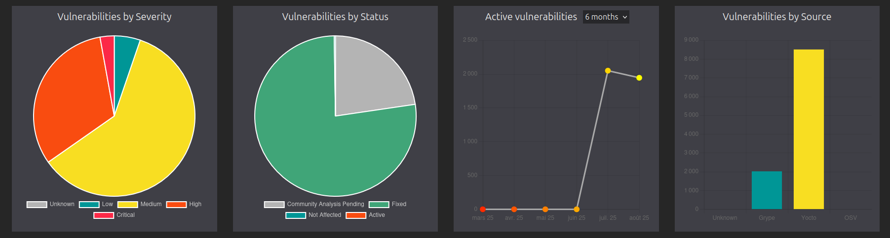

[](https://opensource.org/licenses/Apache-2.0)

`meta-vulnscout` is a Yocto meta-layer that uses `vulnscout` to scan a project, export its Software Bill of Materials (SBOM), and list the vulnerabilities that affect it.
Support for Cyclone DX, SPDX, Yocto JSON files, and Open VEX.

## Prerequisites

The command `docker-compose` or `docker compose` should be available on the host device.

## Requirements

This layer, named `meta-vulnscout`, requires your project to be built with the generation of an SBOM and a CVE report.

If this is not the case yet, you can simply add the following to `build/conf/local.conf`:

```shell
INHERIT += "cve-check"
include conf/distro/include/cve-extra-exclusions.inc
```

You may also need to add `INHERIT += "create-spdx"` if you are not using the default `poky` distro and if your used distro doesn't inherit it already.

Also, if you can add an extra parameter if you use `Cyclone DX` Software Bill of Materials with the following layer `https://github.com/savoirfairelinux/meta-cyclonedx.git` :

```shell
INHERIT += "cyclonedx-export"
```

Also, for a faster NVD database downloading during vulnscout setup, you can set a NVD key with the variable `NVDCVE_API_KEY`.

Yocto Documentation reference : https://docs.yoctoproject.org/ref-manual/variables.html#term-NVDCVE_API_KEY

You can generate a new NVD key at :  https://nvd.nist.gov/developers/request-an-api-key

##  Installation

To install this meta-layer, simply clone the repository into the `sources` directory and add it to your `build/conf/bblayers.conf` file:

```shell
$ cd sources
$ git clone https://github.com/savoirfairelinux/meta-vulnscout.git
```

And in your `bblayers.conf` file:

```shell
BBLAYERS += "/path/to/meta-vulnscout"
```

## Configuration

To enable and configure Vulnscout, you simply add `inherit vulnscout` in your image recipe.

This project contains an example as described in `recipes-core/images/core-image-minimal.bbappend`.

## Using the web interface with a building Docker container

The Yocto task `vulnscout` creates and starts the Docker container with a Web interface available.

Using a Docker container to build the project requires additional configuration to access the web interface.

Indeed, the web interface won't be mapped to the host if the building Docker container is not properly configured.

CQFD requires adding `docker-compose-v2` to your *.cfqd/docker/Dockerfile* and exporting the following variable:

``` bash
export CQFD_EXTRA_RUN_ARGS="-v /run/docker.sock:/run/docker.sock"
```

For a permanent change, you can instead modify the *.cqfdrc* file with
`docker_run_args="-v /run/docker.sock:/run/docker.sock"`.

Now, you can build your image and use the `vulnscout` task with one of these commands:

**If you use CQFD and KAS**
``` bash
cqfd kas shell -c "bitbake -c <your_Yocto_image> -c vulnscout"
```
**If you use CQFD and the script build.sh made by Savoir-Faire Linux**
```bash
cqfd run ./build.sh -- bitbake <your_Yocto_image> -c vulnscout
```

If the container can't be configured (e.g., with kas-container).
Vulnscout web interface can still be run directly on the host with the ' docker-compose` command.

## Building

You can build your image as you normally would.

As a result, you should see a new `.vulnscout` folder in `${TOPDIR}/..` (can be modified with variable `VULNSCOUT_ROOT_DIR`).

The scan and analysis of vulnerabilities can start with the yocto command:

```shell
bitbake core-image-minimal-yoctolabs -c vulnscout
```

Or you can do it manually with the command:

```shell
docker compose -f "<project_root>/.vulnscout/core-image-minimal-yoctolabs/docker-compose.yml" up
```

Without a custom configuration, a web interface will be started at the address `http://localhost:7275`.

## Result



## License

`Copyright (C) 2017-2025 Savoir-faire Linux, Inc.`

meta-vulnscout is released under the Apache 2 license.
