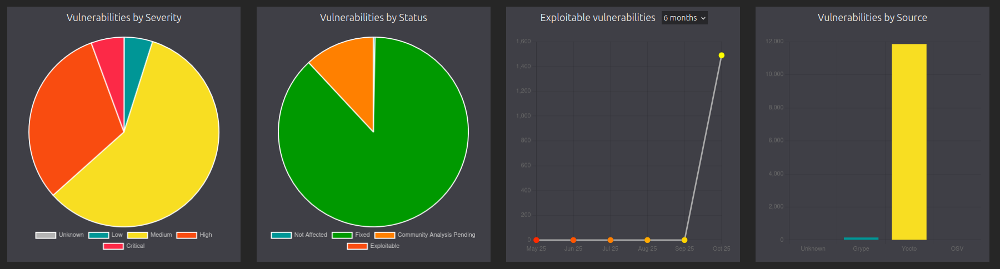

[](https://opensource.org/licenses/Apache-2.0)

`meta-vulnscout` is a Yocto meta-layer that uses
[VulnScout](https://vulnscout.io) to scan a project, export its Software Bill of
Materials (SBOM), and list the vulnerabilities affecting it.

Currently the supported formats are: CycloneDX, SPDX, Yocto JSON files, and
OpenVEX.

## Requirements

- `docker` command

- `python3-packaging` package. If you are running in CQFD, you should add it in
  `.cqfd/docker/Dockerfile`.

##  Installation

Clone the repository into the `sources` directory and add it to your
`build/conf/bblayers.conf` file:

```sh
cd sources
git clone https://github.com/savoirfairelinux/meta-vulnscout.git
```

If you are using submodules to manage your sub-repos, you should include this
meta-layer using the following commands:

```shell
$ cd sources
$ git submodule add https://github.com/savoirfairelinux/meta-vulnscout.git
```

And in your `bblayers.conf` file add the line:

```sh
BBLAYERS += "/path/to/meta-vulnscout"
```

## Configuration

To enable and configure VulnScout, add the following lines to your `local.conf`
or distro config:

```sh
# Required settings for VulnScout
require conf/distro/include/vulnscout-core.inc
```

This configuration enables VulnScout for all image recipes and should be
sufficient for most users. If you want more fine-grained control on which images
are enabling VulnScout, then you can add to your `local.conf` or distro config:

```sh
# Inherit create-spdx to generate SBOMs
# May be required if not using poky distro
INHERIT += "create-spdx"

HOSTTOOLS_NONFATAL += "docker"
```

And then manually `inherit vulnscout` in specific image recipes to enable
VulnScout.

The distro `poky-vulnscout` provided in this repo provides an example of a
complete usage of meta-vulnscout features.

## Extra VulnScout configuration for cve-check improvements

`meta-vulnscout` provides other classes for accurate cve-check file generation.

### Configuration

Add this line to your distro config or `local.conf` to inherit the extra
classes:

```sh
# Enable extra CVE analysis
require conf/distro/include/vulnscout-cve-check.inc
```

### Description

- `kernel_generate_cve_exclusions.bbclass` can be used to integrate a library
  `lib/vulnscout/generate_cve_exclusions_py` derived from the script
  [generate-cve-exclusions.py](https://docs.yoctoproject.org/dev/singleindex.html#generate-cve-exclusions-py).
  \
  It provides extra kernel CVE details and information through the variable
  `CVE_STATUS`. \
  To integrate this script, a .bbappend on the kernel recipe can be used to add
  `inherit kernel_generate_cve_exclusions` as shown on the available example at
  `meta-vulnscout/recipes-kernel/linux/linux-yocto_%.bbappend`


- `improve_kernel_cve_report.bbclass` can be used to integrate the script
  `improve_kernel_cve_report.py` (reference :
  [improve_kernel_cve_report](https://docs.yoctoproject.org/dev/singleindex.html#improve-kernel-cve-report-py)).
  \
  It reduces CVE false positives by 70%-80% and provides detailed responses
  for all kernel-related CVEs by analyzing the files used to build the kernel. \
  To integrate this script, a .bbappend on the image recipe can be used to add
  `inherit improve_kernel_cve_report` as shown on the available example at
  `meta-vulnscout/recipes-core/images/core-image-minimal.bbappend`

- `kernel_filter_nonbuilt_cves.bbclass` can be used to update the cve-check file
  by removing CVEs based on elements that aren't present in the built kernel. A
  CVE linked with a driver that isn't compiled doesn't make your kernel
  vulnerable to it. \
  It reduces the number of kernel CVEs to deal with by
  around 70%. \
  To integrate this class, a simple `inherit kernel_filter_nonbuilt_cves` is
  required in the kernel recipe. After a kernel
  build tree, new files will be located in your deploy directory. A file with
  `.kernel_remaining_cves.json` extension will contain the remaining active
  CVEs, a second file with `.kernel_removed_cves.json` contains the details of
  CVEs that don't apply to your system. \ Also, the virtual kernel cve-check
  file and the final cve-check manifest will both be affected by
  this class analysis setting all non-built CVEs to `Ignored` status with
  `details` set to `cve-not-compiled-in-kernel` and `description` to
  `kernel_filter_nonbuilt_cves detected that this CVE is not affecting the
  current kernel build.`

## Using VulnScout Web Interface

After a normal build, you should see a new `.vulnscout` folder in `${TOPDIR}/..`
(can be modified with variable `VULNSCOUT_ROOT_DIR`).

The scan and analysis of vulnerabilities can be started with:

```sh
bitbake core-image-minimal -c vulnscout
```

VulnScout Docker container can also be started without rescanning for new CVEs
with the following command:

```sh
bitbake core-image-minimal -c do_vulnscout_no_scan
```

Or you can do it manually with the command:

```shell
docker start vulnscout
docker exec vulnscout /scan/src/entrypoint.sh --serve
```

Without a custom configuration, a web interface will be started at the address
`http://localhost:7275`.

## Using VulnScout with a CI

It is possible to launch VulnScout in a CI mode, without the web interface using
the command:

```sh
bitbake core-image-minimal -c vulnscout_ci
```
All the files generated by `vulnscout` will be placed by default here:
`<project_root>/.vulnscout/core-image-minimal/output`

### Options

`vulnscout` in CI mode can be launched with a specific _match condition_ using an
environment variable.

First you need to export the environment variable
`BB_ENV_PASSTHROUGH_ADDITIONS+=" VULNSCOUT_MATCH_CONDITION"`\
For example, using the `export` command:

```bash
export BB_ENV_PASSTHROUGH_ADDITIONS+=" VULNSCOUT_MATCH_CONDITION"
```

Or every time you launch `vulnscout` in the CI mode:

```bash
BB_ENV_PASSTHROUGH_ADDITIONS+=" VULNSCOUT_MATCH_CONDITION" bitbake core-image-minimal -c vulnscout_ci
```
Now you can specify the match condition with the `VULNSCOUT_MATCH_CONDITION`
variable every time you use `vulnscout` in CI mode:

```bash
VULNSCOUT_MATCH_CONDITION="cvss >= 9.0" BB_ENV_PASSTHROUGH_ADDITIONS+=" VULNSCOUT_MATCH_CONDITION" bitbake core-image-minimal -c vulnscout_ci
```

With this command, `vulnscout` will list all the CVEs of the vulnerabilities
with a CVSS score equal to or higher than 9.0.

It's possible to set more than one condition:
```bash
VULNSCOUT_MATCH_CONDITION="cvss >= 9.0 or (cvss >= 7.0 and epss >= 50%)" bitbake core-image-minimal -c vulnscout_ci
```

With this command, `vulnscout` will list all vulnerabilities critical (CVSS >=
9.0) or those with both a high CVSS and EPSS score.

> [!NOTE]
> Setting up the match condition this way will override the
> "VULNSCOUT_MATCH_CONDITION" variable in the *vulnscout.bbclass*

> [!WARNING]
> If you set the "VULNSCOUT_MATCH_CONDITION" with the `export` command in your
> shell, it will always use it until you set it to null

## Generating reports

meta-vulnscout is capable of generating built-in reports and even custom ones.
The built-in reports are the following:
  - all_assessments.adoc
  - match_condition.adoc
  - summary.adoc
  - time_estimate.csv
  - vulnerabilities.csv
  - vulnerability_summary.txt

All custom reports must be placed in the following folder _.vulnscout/custom\_templates_

> [!NOTE]
> The custom_templates could be changed through the
> "VULNSCOUT_CUSTOM_TEMPLATES_DIR" variable in the *vulnscout.bbclass*

There are two ways to generate reports with meta-vulnscout

### Generating reports without a scan
Multiple reports can be created within one command without a scan.

You must specify the reports you wish to generate to the variable "VULNSCOUT_REPORT" in the *vulnscout.bbclass*

Example:
``` bash
VULNSCOUT_REPORT = "summary.adoc time_estimate.csv"
```

Then reports can be created without scan using the command:

``` bash
bitbake core-image-minimal -c vulnscout_report
```

The reports are generated by default in the folder `.vulnscout/<image_basename-machine_suffix>/`

### Generating reports during CI scan

When launching a CI scan you can specify one or multiple reports to generate it at the same time.

Specify the reports in the variable "VULNSCOUT_REPORT_CI"

Now when using the command `-c vulnscout_ci` the reports will be automatically generated.

## Exporting SBOM Files

meta-vulnscout can export the enriched project data as standard SBOM formats.
Exported files are written to the outputs directory (default: `.vulnscout/<image_basename-machine_suffix>/`).

To export the SBOM files, you have to specify the files in the variable "VULNSCOUT_EXPORT" in the *vulnscout.bbclass*.

For now you can export three types of SBOM:
  - cdx
  - spdx
  - openvex

Finally you just need to launch the command:

``` bash
bitbake core-image-minimal -c vulnscout_export
```

### Use environment variables in templates

In VulnScout templates, you can use environment variables as stated in the
documentation. These variables should be automatically detected if they are in a
template in the `custom_templates` directory, and that the template is in use in
`VULNSCOUT_ENV_GENERATE_DOCUMENTS`. Then the content of the variable is appended
to the environment in the docker compose file with `VULNSCOUT_TPL_` prefix.

## Accelerate NVD database download

For faster NVD database downloads during VulnScout setup, you can set an NVD
key with the variable `NVDCVE_API_KEY`.

Yocto Documentation reference : https://docs.yoctoproject.org/ref-manual/variables.html#term-NVDCVE_API_KEY

You can generate a new NVD key at : https://nvd.nist.gov/developers/request-an-api-key

## Using the web interface with a building Docker container

The Yocto task `vulnscout` creates and starts the Docker container with a Web
interface available.

Using a Docker container to build the project requires additional configuration
to access the web interface.

Indeed, the web interface won't be mapped to the host if the building Docker
container is not properly configured.

CQFD requires adding `docker-compose` (for Ubuntu 22.04 and earlier) or
`docker-compose-v2` (for Ubuntu 24.04 and later) to your
*.cqfd/docker/Dockerfile* and exporting the following variable:

``` bash
export CQFD_EXTRA_RUN_ARGS="-v /run/docker.sock:/run/docker.sock"
```

For a permanent change, you can instead modify the `.cqfdrc` file with
`docker_run_args="-v /run/docker.sock:/run/docker.sock"`.

Now, you can build your image and use the `vulnscout` task with one of these
commands:

**If you use CQFD and KAS**
``` bash
cqfd kas shell -c "bitbake -c <your_Yocto_image> -c vulnscout"
```

**If you use CQFD and the script build.sh made by Savoir-faire Linux**
```bash
cqfd run ./build.sh -- bitbake <your_Yocto_image> -c vulnscout
```

If the container can't be configured (e.g., with kas-container),
VulnScout's web interface can still be run directly on the host with the
`docker-compose` command.

## Using [meta-sbom-cve-check](https://github.com/bootlin/meta-sbom-cve-check)

The output of `meta-sbom-cve-check` is supported in VulnScout. However, this
layer is incompatible with the cve-check improvements provided in
`meta-vulnscout`. As a consequence, do not use
`conf/distro/include/vulnscout-cve-check.inc` with `meta-sbom-cve-check`.

## Result



## License

`Copyright (C) 2025-2026 Savoir-faire Linux, Inc.`

meta-vulnscout is released under the Apache License 2.0.
