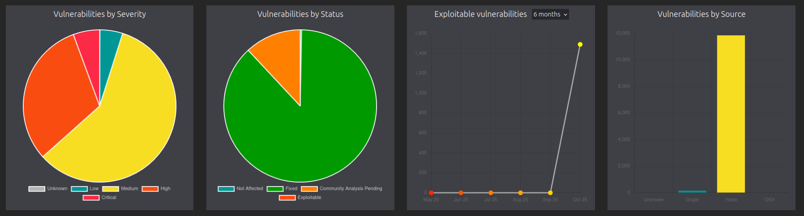

[](https://opensource.org/licenses/Apache-2.0)

`meta-vulnscout` is a Yocto meta-layer that uses `vulnscout` to scan a project, export its Software Bill of Materials (SBOM), and list the vulnerabilities that affect it.
Support for Cyclone DX, SPDX, Yocto JSON files, and Open VEX.

## Requirements

The command `docker-compose` or `docker compose` should be available on the host device.

##  Installation

To install this meta-layer, simply clone the repository into the `sources` directory and add it to your `build/conf/bblayers.conf` file:

```shell
$ cd sources
$ git clone https://github.com/savoirfairelinux/meta-vulnscout.git
```
And in your `bblayers.conf` file:

```shell
BBLAYERS += "/path/to/meta-vulnscout"
```

## Configuration

To enable and configure Vulnscout, you simply add `inherit vulnscout` in your image recipe.

This project contains an example as described in `recipes-core/images/core-image-minimal.bbappend`.

## Using VulnScout Web Interface

After a normal build, you should see a new `.vulnscout` folder in `${TOPDIR}/..` (can be modified with variable `VULNSCOUT_ROOT_DIR`).

The scan and analysis of vulnerabilities can start with the yocto command:

```shell
bitbake core-image-minimal -c vulnscout
```

Or you can do it manually with the command:

```shell
docker compose -f "<project_root>/.vulnscout/core-image-minimal/docker-compose.yml" up
```

Without a custom configuration, a web interface will be started at the address `http://localhost:7275`.

## Using VulnScout with a CI

It is possible to launch Vulnscout in a CI mode, without the web interface.
To launch `vulnscout` in a CI mode, use this command:
```bash
bitbake core-image-minimal -c vulnscout_ci
```
All the files generated by `vulnscout` will be placed by default here: *<project_root>/.vulnscout/core-image-minimal/output*

**Options**\
`vulnscout` in CI mode can be launched with a specific `fail condition` using an environment variable.

First you need to export the environment variable `BB_ENV_PASSTHROUGH="VULS_FAIL_CONDITION"`\
Either way, by using the `export` command:

```bash
export BB_ENV_PASSTHROUGH="VULS_FAIL_CONDITION"
```
Or every time you launch `vulnscout` in the CI mode:

```bash
BB_ENV_PASSTHROUGH="VULS_FAIL_CONDITION" bitbake core-image-minimal -c vulnscout_ci
```
Now you can precise the fail condition with the `VULS_FAIL_CONDITION` variable every time you use `vulnscout` in CI mode:

```bash
VULS_FAIL_CONDITION="cvss >= 9.0" BB_ENV_PASSTHROUGH="VULS_FAIL_CONDITION" bitbake core-image-minimal -c vulnscout_ci
```
With this command, `vulnscout` will list all the CVEs of the vulnerabilities with a CVSS score equal to or higher than 9.0.

It's possible to set more than one condition:

```bash
VULS_FAIL_CONDITION="cvss >= 9.0 or (cvss >= 7.0 and epss >= 50%)" bitbake core-image-minimal -c vulnscout_ci
```
With this command, `vulnscout` will list all vulnerabilities critical (CVSS >= 9.0) or those with both a high CVSS and EPSS score.

> [!NOTE]
> Setting up the fail condition this way will overload the "VULNSCOUT_ENV_FAIL_CONDITION" variable in the *vulnscout.bbclass*

> [!WARNING]
> If you set the "VULS_FAIL_CONDITION" with the `export` command in your shell, it will always uses it until you set it to null

## Accelerate NVD database download

Also, for a faster NVD database downloading during VulnScout setup, you can set a NVD key with the variable `NVDCVE_API_KEY`.

Yocto Documentation reference : https://docs.yoctoproject.org/ref-manual/variables.html#term-NVDCVE_API_KEY

You can generate a new NVD key at :  https://nvd.nist.gov/developers/request-an-api-key

## Using the web interface with a building Docker container

The Yocto task `vulnscout` creates and starts the Docker container with a Web interface available.

Using a Docker container to build the project requires additional configuration to access the web interface.

Indeed, the web interface won't be mapped to the host if the building Docker container is not properly configured.

CQFD requires adding `docker-compose-v2` to your *.cfqd/docker/Dockerfile* and exporting the following variable:

``` bash
export CQFD_EXTRA_RUN_ARGS="-v /run/docker.sock:/run/docker.sock"
```

For a permanent change, you can instead modify the *.cqfdrc* file with
`docker_run_args="-v /run/docker.sock:/run/docker.sock"`.

Now, you can build your image and use the `vulnscout` task with one of these commands:

**If you use CQFD and KAS**
``` bash
cqfd kas shell -c "bitbake -c <your_Yocto_image> -c vulnscout"
```
**If you use CQFD and the script build.sh made by Savoir-Faire Linux**
```bash
cqfd run ./build.sh -- bitbake <your_Yocto_image> -c vulnscout
```

If the container can't be configured (e.g., with kas-container).
Vulnscout web interface can still be run directly on the host with the ' docker-compose` command.

## Using improve kernel cve script
In the recent update of Whinlatter, a new script named "improve_kernel_cve_report.py" has been realesed.
This script is better at finding CVEs then `cve-check` so it is now possible to use it with meta-vulnscount.

All you need to do is to set the variable `VULNSCOUT_KERNEL_IMPROVE_CVE` to true in the `vulnscout.bbclass` file.

> [!WARNING]
> To use this script, is it needed to clone this project https://git.kernel.org/pub/scm/linux/security/vulns.git/log/ which contain the vulnerabilities.
> meta-vulnscout will automated clone and use the project when the variable `VULNSCOUT_KERNEL_IMPROVE_CVE` is set to true.
> The script is only working whith SPDX 3.0

## Result



## License

`Copyright (C) 2017-2025 Savoir-faire Linux, Inc.`

meta-vulnscout is released under the Apache 2 license.
